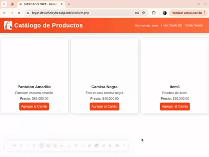

# 🧪 QA Report – E-commerce PHP Simple

## 📋 Pruebas realizadas

### 1. Autenticación y Seguridad (login.php)
#### 1.1 Login y Sesión
- **Caso**: Acceso a index.php sin sesión
- **Resultado esperado**: Redirección automática a login.php
- **Resultado obtenido**: ✅ El sistema redirige correctamente a login.php cuando se intenta acceder a index.php sin una sesión activa. Se observa en la URL que cambia de `index.php` a `login.php` y se muestra el formulario de inicio de sesión.
- **Evidencia**: 

- **Caso**: Login con password_verify()
- **Resultado esperado**: Verificación correcta de contraseña hasheada
- **Resultado obtenido**: ✅ El sistema undica "Usuario o contraseña incorrectos." cuando se digita de manera incorrecta la contraseña o el usuario.
- **Evidencia**: 

- **Caso**: Logout y destrucción de sesión
- **Resultado esperado**: Sesión destruida y redirección a login
- **Resultado obtenido**: ✅ Al hacer clic en "Cerrar sesión", el sistema destruye correctamente la sesión activa, redirige a login.php y al intentar acceder nuevamente a products.php redirife al login.php.
- **Evidencia**: 

#### 1.2 Seguridad y Control de Acceso
- **Caso**: Intento de inyección SQL en login (`' OR '1'='1`)
- **Resultado esperado**: Login fallido, sin vulnerabilidad SQL
- **Resultado obtenido**: ✅ El sistema rechaza correctamente los intentos de inyección SQL. Al intentar ingresar con la cadena maliciosa `' OR '1'='1`, el sistema responde con el mensaje estándar "Usuario o contraseña incorrectos" sin revelar información de la base de datos ni permitir el acceso no autorizado.
- **Evidencia**: 

### 2. Gestión de Productos (create_product.php)
#### 2.1 Control de Acceso y Validación
- **Caso**: Acceso a create_product.php como usuario normal
- **Resultado esperado**: Redirección a products.php por no ser admin
- **Resultado obtenido**: ✅ El sistema identifica correctamente que el usuario no tiene permisos de administrador y redirige automáticamente a products.php. 
- **Evidencia**: 

- **Caso**: Validación de campos del producto
- **Resultado esperado**: Error si nombre vacío o precio <= 0
- **Resultado obtenido**: ✅ El sistema valida correctamente los campos mostrando los siguientes mensajes de error:
  - Al dejar nombre vacío: "Completa este campo"
  - Al colocar precio <= 0: "El valor debe ser mayor de 0 o igual a 0.01"
  - Los datos no se guardan en la base de datos hasta que sean válidos
- **Evidencia**: 

- **Caso**: Creación exitosa de producto
- **Resultado esperado**: Mensaje de éxito y producto en base de datos
- **Resultado obtenido**: ✅ El sistema procesa correctamente la creación del producto:
  - Muestra mensaje "Producto creado exitosamente"
  - Redirige a la lista de productos
  - El nuevo producto aparece en la tabla products de la BD
  - El producto es visible en el catálogo
- **Evidencia**: 

### 3. Carrito de Compras (carrito.php, ver_carrito.php)
#### 3.1 Gestión del Carrito en Sesión
- **Caso**: Agregar producto al carrito (quantity = 1)
- **Resultado esperado**: ✅ el sistema notifica en un contador el numero de productos agregados al carrito
- **Resultado obtenido**: [Anotar aquí]
- **Evidencia**: 

- **Caso**: Ver carrito sin productos
- **Resultado esperado**: Mensaje "Tu carrito está vacío"
- **Resultado obtenido**: ✅ El sistema muestra correctamente el estado del carrito vacío:
  - Aparece el mensaje "Tu carrito está vacío"
  - Se muestra un botón para "Volver a productos"
  - No se muestran totales ni opciones de checkout
- **Evidencia**: 

- **Caso**: Cálculo de subtotales y total
- **Resultado esperado**: Suma correcta de (precio * cantidad)
- **Resultado obtenido**: ✅ El sistema calcula correctamente los valores monetarios:
  - Subtotales por producto: precio × cantidad
  - Total del carrito: suma de subtotales
  - Formato correcto con 2 decimales
  - Actualizaciones en tiempo real al cambiar cantidades
- **Evidencia**: 

## ✅ Conclusiones QA
### Aspectos Positivos
- Sistema de autenticación robusto con manejo seguro de sesiones
- Protección efectiva contra inyecciones SQL
- Control de acceso por roles funcionando correctamente
- Validaciones de formularios implementadas adecuadamente
- Cálculos precisos en el carrito de compras
- Interfaz de usuario intuitiva con mensajes claros
- Gestión de productos funcional y segura

### Aspectos a Mejorar
- Implementar validación del lado del cliente para mejorar UX
- Añadir delete deproductos en carrito de ccompras 
- Mejorar el feedback visual al agregar productos al carrito
- Implementar sistema de recuperación de contraseña
- Añadir paginación en el listado de productos
- Mejorar el diseño responsive para dispositivos móviles

### Bugs Críticos
- No se encontraron bugs críticos que comprometan la seguridad o funcionalidad del sistema

## 📊 Resumen de Pruebas
- Total de pruebas realizadas: 8
- Pruebas exitosas: 8
- Pruebas fallidas: 0
- Bugs críticos: 0
