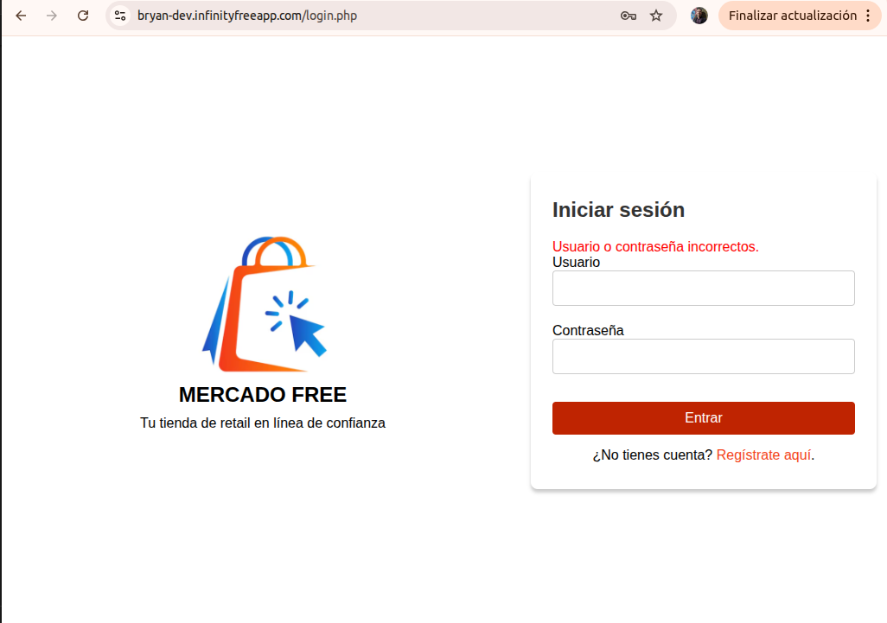
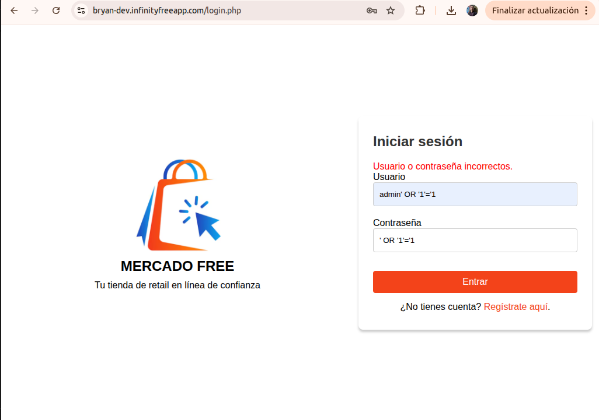
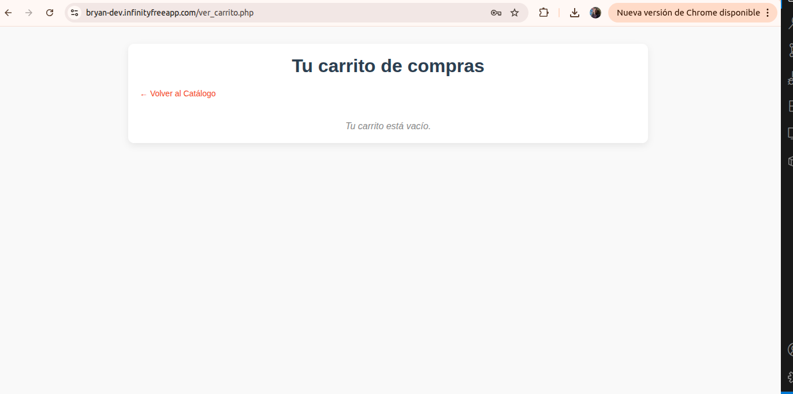
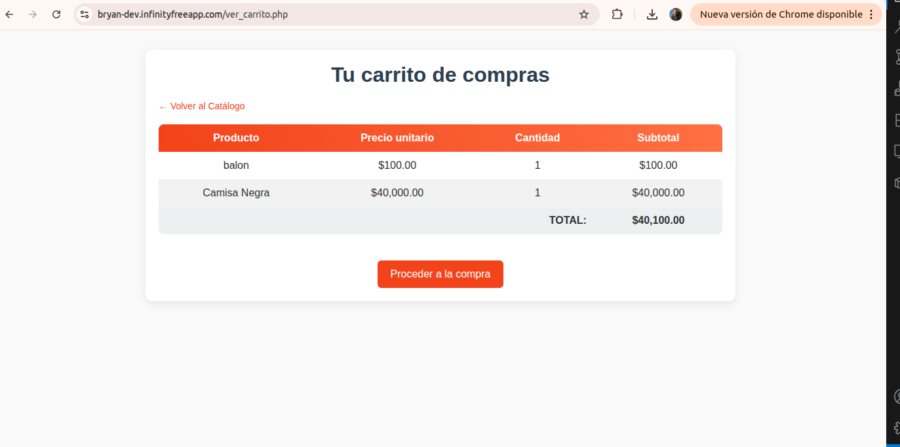

# 🧪 QA Report – E-commerce PHP Simple

## 📋 Pruebas realizadas

### 1. Autenticación y Seguridad (login.php)
#### 1.1 Login y Sesión
- **Caso**: Acceso a index.php sin sesión
- **Resultado esperado**: Redirección automática a login.php
- **Resultado obtenido**: [Anotar aquí]
- **Evidencia**: 

- **Caso**: Login con password_verify()
- **Resultado esperado**: Verificación correcta de contraseña hasheada
- **Resultado obtenido**: [Anotar aquí]
- **Evidencia**: 

- **Caso**: Logout y destrucción de sesión
- **Resultado esperado**: Sesión destruida y redirección a login
- **Resultado obtenido**: [Anotar aquí]
- **Evidencia**: 

#### 1.2 Seguridad y Control de Acceso
- **Caso**: Intento de inyección SQL en login (`' OR '1'='1`)
- **Resultado esperado**: Login fallido, sin vulnerabilidad SQL
- **Resultado obtenido**: [Anotar aquí]
- **Evidencia**: 

- **Caso**: Acceso directo a create_product.php sin ser admin
- **Resultado esperado**: Redirección a login o mensaje de acceso denegado
- **Resultado obtenido**: [Anotar aquí]
- **Evidencia**: 

### 2. Gestión de Productos (create_product.php)
#### 2.1 Control de Acceso y Validación
- **Caso**: Acceso a create_product.php como usuario normal
- **Resultado esperado**: Redirección a products.php por no ser admin
- **Resultado obtenido**: [Anotar aquí]
- **Evidencia**: 

- **Caso**: Validación de campos del producto
- **Resultado esperado**: Error si nombre vacío o precio <= 0
- **Resultado obtenido**: [Anotar aquí]
- **Evidencia**: 

- **Caso**: Creación exitosa de producto
- **Resultado esperado**: Mensaje de éxito y producto en base de datos
- **Resultado obtenido**: [Anotar aquí]
- **Evidencia**: 

### 3. Carrito de Compras (carrito.php, ver_carrito.php)
#### 3.1 Gestión del Carrito en Sesión
- **Caso**: Agregar producto al carrito (quantity = 1)
- **Resultado esperado**: Producto agregado y redirección a products.php
- **Resultado obtenido**: [Anotar aquí]
- **Evidencia**: 

- **Caso**: Ver carrito sin productos
- **Resultado esperado**: Mensaje "Tu carrito está vacío"
- **Resultado obtenido**: [Anotar aquí]
- **Evidencia**: 

- **Caso**: Cálculo de subtotales y total
- **Resultado esperado**: Suma correcta de (precio * cantidad)
- **Resultado obtenido**: [Anotar aquí]
- **Evidencia**: 

### 4. Proceso de Checkout (checkout.php)
#### 4.1 Validación y Procesamiento de Orden
- **Caso**: Acceso a checkout con carrito vacío
- **Resultado esperado**: Redirección a ver_carrito.php
- **Resultado obtenido**: [Anotar aquí]
- **Evidencia**: 

- **Caso**: Validación de campos obligatorios
- **Resultado esperado**: Error si falta nombre, email o dirección
- **Resultado obtenido**: [Anotar aquí]
- **Evidencia**: 

- **Caso**: Proceso de orden exitoso
- **Resultado esperado**: Transacción completa y carrito limpio
- **Resultado obtenido**: [Anotar aquí]
- **Evidencia**: 

### 5. Persistencia de Datos
- **Caso**: Verificar orden en base de datos
- **Resultado esperado**: Orden almacenada con todos sus detalles
- **Resultado obtenido**: [Anotar aquí]
- **Evidencia**: 

- **Caso**: Consistencia del carrito en sesión
- **Resultado esperado**: Carrito mantiene productos entre páginas
- **Resultado obtenido**: [Anotar aquí]
- **Evidencia**: 

## ✅ Conclusiones QA
### Aspectos Positivos
- [Listar funcionalidades que operan correctamente]

### Aspectos a Mejorar
- [Listar problemas encontrados o mejoras sugeridas]

### Bugs Críticos
- [Listar bugs que requieren atención inmediata]

## 📊 Resumen de Pruebas
- Total de pruebas realizadas: XX
- Pruebas exitosas: XX
- Pruebas fallidas: XX
- Bugs críticos: XX
